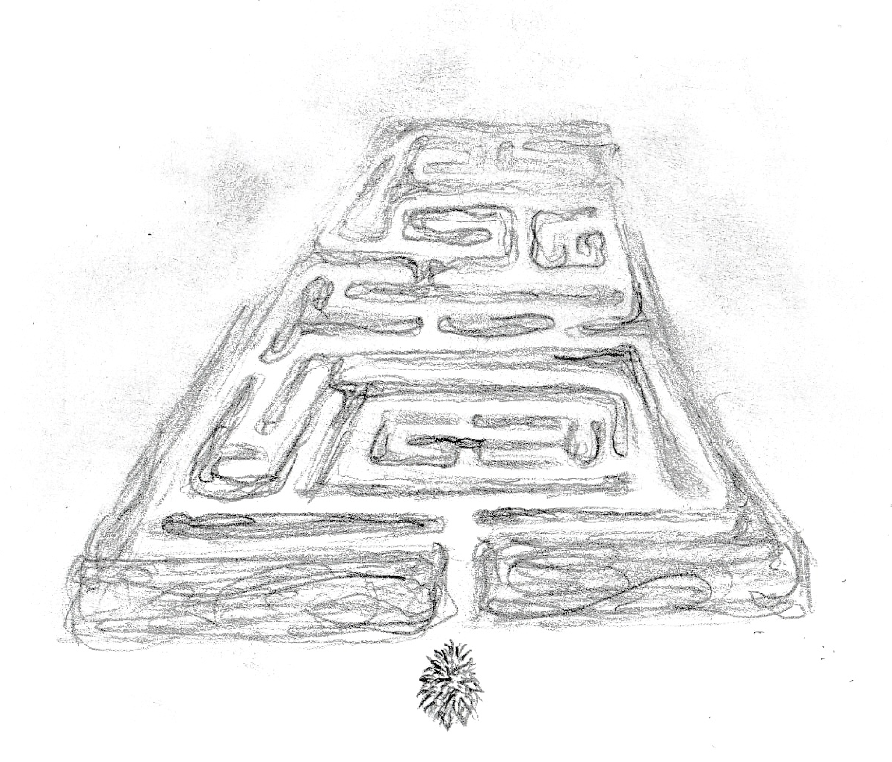

> "Do you know where the idea of a labyrinth first came from?"
> 
> I shake my head.
>
> "It was the ancient Mesopotamians. They pulled out animal intestines——sometimes human intestines, I expect——and used the shape to predict the future. They admired the complex shape of intestines. So the prototype for labyrinths is, in a word, guts. Which means that the principle for the labyrinth is inside you. And that correlates to the labyrinth *outside*."
> 
> "Another metaphor," I comment.
> 
> "That's right. A reciprocal metaphor. Things outside you are projections of what's inside you, and what's inside you is a projection of what's outside. So when you step into the labyrinth outside you, at the same time you're stepping into the labyrinth *inside*. Most definitely a risky business."
> 
> — Haruki Murakami, *Kafka on the Shore*, trans. Philip Gabriel (Vintage, 2005), 352.
