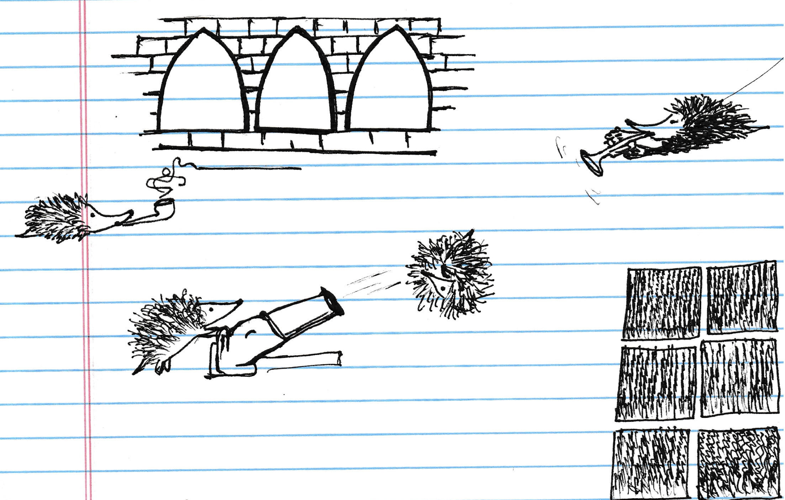
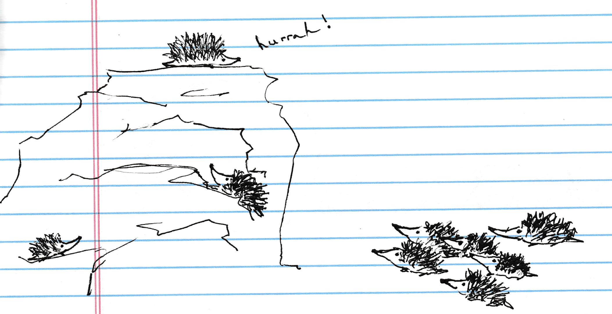

In Book 2 Chapter XX of *War & Peace* ([Project Gutenberg](https://www.gutenberg.org/files/2600/2600-h/2600-h.htm#link2HCH0048)), Captain Túshin imagines the enemy's guns as "pipes from which occasional puffs were blown by an invisible smoker," commands his orderly to refill a big Russian pipe to fire back, and of course, is smoking a literal little pipe all the while.
